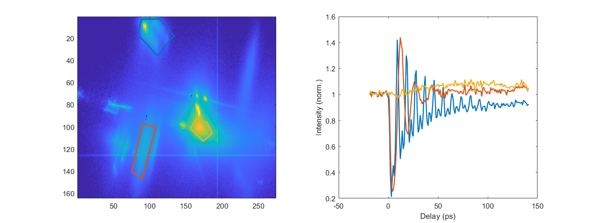
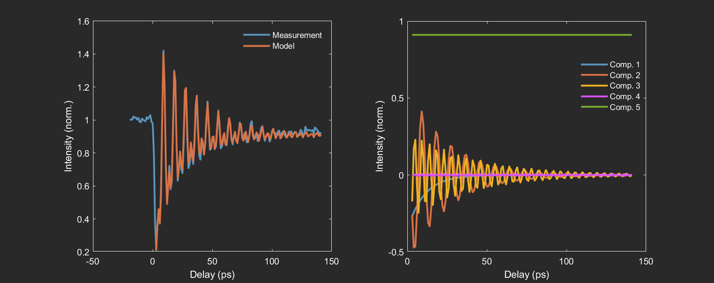

# trXRD_cube_utilities
An object-oriented MATLAB coding framework to help with analysis of ultrafast x-ray diffraction experiments.

See `examples.m` for demonstrations on how to use the Cube class defined in `Cube.m` This script requires some data that I won't post to GitHub, so ask me for it if you would like to run it.

Stand-alone function versions of the class methods are also provided in `/functions`.

Below are some use cases of the Cube class:

- Manual ROI-based processing and plotting:

- Autoregressive modeling using the LPSVD method of Barkhuijsen *et al.*, *J. Magn. Reson* 61, 465 (1985):

- 
