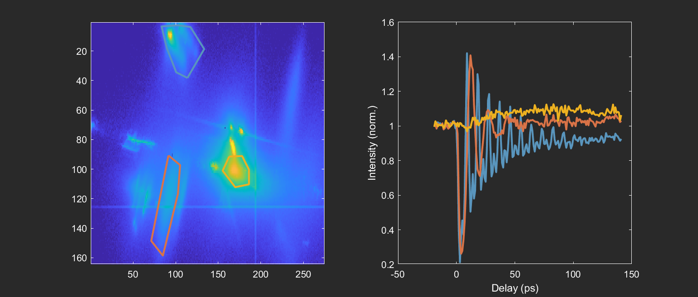

# trXRD_cube_utilities
An object-oriented MATLAB coding framework to help with analysis of ultrafast x-ray diffraction experiments.

See `examples.m` for demonstrations on how to use the Cube class defined in `Cube.m`. This script requires some data that I won't post to GitHub, so ask me for it if you would like to run it.

Below are some use cases of the Cube class:

- Manual ROI-based processing and plotting:

- Autoregressive modeling using the LPSVD decomposition procedure of Barkhuijsen *et al.*, *J. Magn. Reson.* 61, 465 (1985):

- Plotting dispersion relations across line cuts on the detector image:

- Automatically identify signal on the detector image and automatically group pixels into ROIs using a principal component analysis / DBSCAN clustering sequence:

- Map an angle-scan measurement into reciprocal space:

