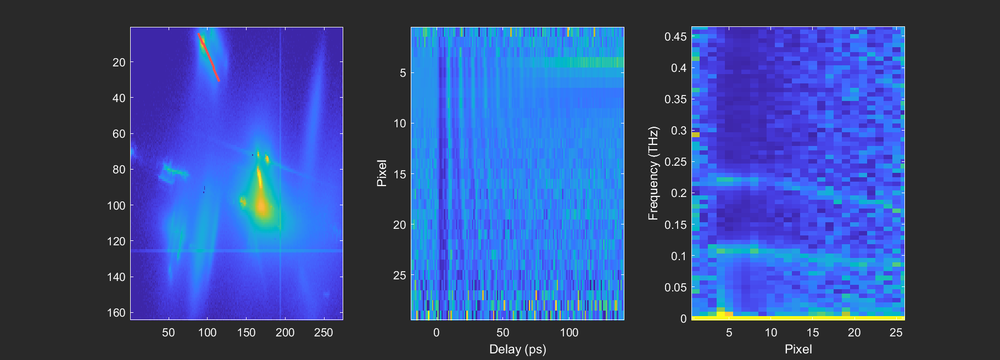
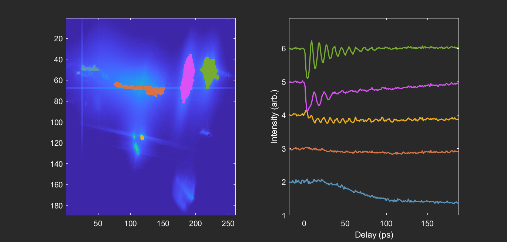
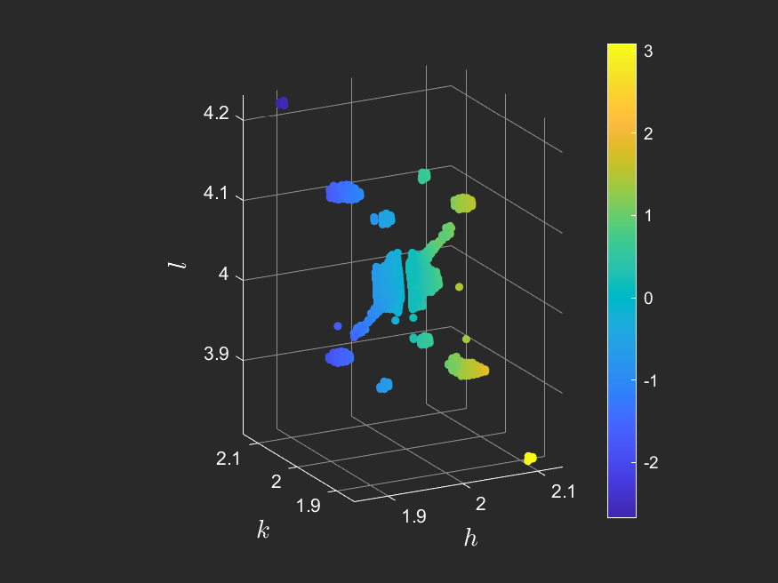

# trXRD_cube_utilities
An object-oriented MATLAB coding framework to help with analysis of ultrafast x-ray diffraction experiments.

## Examples

See `examples.m` for demonstrations on how to use the `Cube` class for analysis. This script requires some data that I won't post to GitHub, so ask me for it if you would like to run it.

Below are some use cases of the Cube class:

- Manual ROI-based processing and plotting:

- Autoregressive modeling using the LPSVD decomposition procedure of Barkhuijsen *et al.*, *J. Magn. Reson.* 61, 465 (1985):

- Plotting dispersion relations across line cuts on the detector image:

- Automatically identify signal on the detector image and automatically group pixels into ROIs using a principal component analysis / DBSCAN clustering sequence:

- Map an angle-scan measurement into reciprocal space:

## Documentation

The `Cube` class has the following properties:
- `on` / `off`: structs containing the data for the pump-on and pump-off measurements for the run, which consist of the following fields:
    - `imgs`: the binned detector images in "cube" format, where the first two dimensions are the dimensions of the detector array and the third dimension is the scan variable binning axis.
    - `scan_var`: the values of the bins for the scan variable (usually pump-probe delay, or a goniometer angle).
    - `i0`: summed intensity and position (IPM) monitor values for all the measurements in a bin. You need to divide the detector images by this to account for varaitions in x-ray intensity and variable bin counts.
    - `bin_counts`: the number of individual measurements summed into each bin.
- `runs`: a cell array containing the run numbers for each run used to generate the `Cube` instance. If this array contains more than one run number, the runs are summed together to generate the `Cube` instance.
- `scan_var_name`: the name of the variable being scanned. Usually 'delay`, or a goniometer angle ('phi', 'theta', 'chi', etc.). Some of the class functions are only intended for certain kinds of scan variables. For instance, hkl mapping only works for angle scans, and LPSVD modeling only works for delay scans.
-  `info`: a string briefly describing the `Cube` instance. Used for plot titles and legend labels, as well as filenames for saving data derived from the instance.
-  `geometry`: a `geometry` struct defined according to the `xdscode` package convention that describes the geometric configuration for the run. This is required for hkl mapping.
-  `masks`: a cell array of masks generated by the methods `thresh_and_plot` and `plot_rois`. Each entry in the cell array is a struct with the following fields:
    - `mask`: a 2D boolean array of the mask.
    - `type`: the type of mask generated. Is either 'thresh' for threshold-based masks, or 'ROI' for ROI-based masks.
    - `sig`: the signal generated by integrating over the detector after applying the mask.
    - `thresh`: the threshold value used in `thresh_and_plot` to generate the mask; only defined for 'thresh'-type masks.
    - `roi`: 2D array containing the vertices of the polygon drawn to create the mask using `plot_rois`; only defined for 'ROI'-type masks.
    - `LPSVD`: struct with the autoregressive LPSVD decomposition of `sig`. Contains the following fields:
      - `w`: angular frequencies
      - `b`: damping rates
      - `ph`: phases
      - `amp`: amplitudes
      - `t`: time array (same as input)
      - `x`: data fitted over `t` (same as input)
      - `y`: signal for each component in the decomposition
      - `z`: total signal in the decomposition
      - `ssd`: sum of square deviations for the fit
      - `L`: number of singular values of the data matrix to keep during fitting.
      - `rat`: the ratio of the number of autoregression coefficients to the number of time points in the data.
- `lineout`: a struct created by the `plot_lineout` method, containing information about the signal over a drawn lineout over the detector image. It contains the following fields:
    - `pixels`: a 2D array containing the x and y indices of the pixels in the lineout.
    - `inds`: flattened pixel indices (only flattened over the first two dimensions of `imgs`) for the points in the lineout.
    - `sig`: a 2D array containing the signal at every pixel in the lineout.
    - `fft`: modulus of the Fourier transform of `sig` along the `scan_var` coordinate.
- `normed_by_i0`: boolean representing whether the cube has used `norm_i0` to divide out systematic x-ray intensity fluctuations.
- `hkl_scatter`: an $n \times 5$ array containing the hkl mapping output of `hklmap`. The first three columns are positions in reciprocal space ($h$, $k$, and $l$), the fourth column is the pixel intensity for a given `scan_var` value, and the fifth column is the value of `scan_var`.
